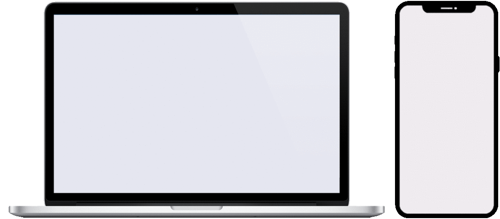

# DevRadar

DevRadar is a platform to locate nearby developers, using the location and the github profiles to get in contact with. The management of the developers can be made in a web interface, and the search can be made in a mobile interface.

This project was developed using **Node.js** to *Backend*, **React** to *Frontend Web*, and **React Native** to *Frontend Mobile*.

## Demo

## Prerequirements

### Node.js

Install the latest stable version (LTS - Long Term Support) of [**Node.js**](https://www.nodejs.org/en/download/package-manager/).

Execute the command `node -v` to check if is already installed.

### Expo-CLI (or Android/iOS Emulator)

To test the use of the mobile interface you need an emulator of Android/iOS system, or you can use [**Expo-CLI**](https://www.docs.expo.io/workflow/expo-cli/).

In case of using **Expo-CLI**, you also need to install [**Expo**](https://www.play.google.com/store/apps/details?id=host.exp.exponent&hl=en) app in the Android mobile device or [**Expo Client**](https://apps.apple.com/us/app/expo-client/id982107779) app in the iOS mobile device.

### MongoDB

The database system used in this project is **MongoDB**, a non-relational database. You can setup the database using one of the next options:

* Install and setup [**MongoDB**](https://www.mongodb.com/download-center/community) in local machine.

* Use a [**MongoDB** Docker Image](https://www.hub.docker.com/_/mongo), to setup a Docker Container running MongoDB in a isolated environment, inside your local machine.

* Use the Cloud Service [**Mongodb** Atlas](https://www.mongodb.com/cloud/atlas), to setup a account and configure a database running outside of your local machine, in a Cloud Platform.

### Configuration

* *(Required)* - Create a database in your previous setup of **MongoDB** and give a intuitive name like `devradar`.
* *(Required)* - Edit the file `./backend/config.json`, to configure your **MongoDB** database: 
    * *"URI_MONGODB": "**\<HOST\>:\<PORT\>/\<DATABASE\>**"*
* *(Required)* - Edit the file `./mobile/config.json`, to configure your local IP address: 
    * *"LOCAL_IP": "**\<LOCAL_IP\>**"*
* *(Optional)* - If you need to configure a different port for the *Backend*, edit the file `config.json` in all tree directories (`backend`, `web`, `mobile`):
    * *"PORT_BACKEND": "**\<PORT\>**"*
* *(Optional)* - If you need to configure a different port for the *Frontend Web*, edit the file `./frontend/package.json`:
    * *{ ...,  "scripts": { "start": "set PORT=**\<PORT\>** && ...", ...}, ...}*

## Install

The project have tree main directories: `backend`, `web` and `mobile`.

To install all the packages you need to run `npm install` inside each directory.

## Run

To execute the *Backend* and use the API, run `npm start`. 

To execute the *Frontend Web* and use the web interface, run `npm start`. Wait for opnening a tab in the browser with the interface.

To execute the *Frontend Mobile* and use the mobile interface, run `npm start`. Wait for opening a tab in the browser with a *QR code*, that you need to scan with your mobile device, using the **Expo** app. You also need to be connected to the same network, in both devices.

> **NOTES:**
> * The *Frontend Web* and *Frontend Mobile* depend on the *Backend* to execute operations that need access to the datatbase, and will show some errors if you try to done some of those operations without the *Backend* running.
> * When the **Expo-CLI** start running and connecting with the mobile device, if you get some error like: *Error: ENOSPC: System limit for number of file watchers reached*, try this [solution](https://github.com/guard/listen/wiki/Increasing-the-amount-of-inotify-watchers#the-technical-details
).
> * If you are using *Windows* and run into problems connecting the **Explo** app in mobile device with the running **Expo-CLI**, try to turn off the *Windows Firewall* for your private network.

## Usage

### Backend

Once you run the *Backend*, and assuming that the database is up, you can start using and sending request, directly through the API.

| Method | URL           | Query Params                            | Route Params      | Body                                          |
| ------ | ------------- | --------------------------------------- | ----------------- | --------------------------------------------- |
| GET    | /devs         |                                         |                   |                                               |
| POST   | /devs         |                                         |                   | {github_username, techs, latitude, longitude} |
| PUT    | /devs/update  |                                         | github_username   | {bio, techs}                                  |
| DELETE | /devs/destroy |                                         | github_username   |                                               |
| GET    | /search       | latitude, longitude, maxDistance, techs |                   |                                               |

### Frontend Web

With the *Backend* running, and the *Frontend Web* also up, you see the interface in your browser. Now you can create a new registry as a developer, giving the github username, technologies that you work on, and your location. Also, you can update or delete the registry of each developer.

### Frontend Mobile

After scan the *QR code* in your mobile device, and again, with the *Backend* running, you will be able to see the interface of the *Frontend Mobile*. Now you can search for developers nearby the location that you are in the map, and based on some of the tecnlogies that you look for. After search and find some developers, you can see some details, by clicking on them, and access to the github page, by clicking on the description.

## Acknowledgments

I developed part of this project during the [OmniStack Week 10](https://www.github.com/Rocketseat/semana-omnistack-10) (by [Rockeseat](https://www.rocketseat.com.br/) and [Diego Fernandes](https://www.github.com/diego3g)).

## License

This project is licensed under the MIT License - see the [LICENSE.md](LICENSE.md) file for details.
